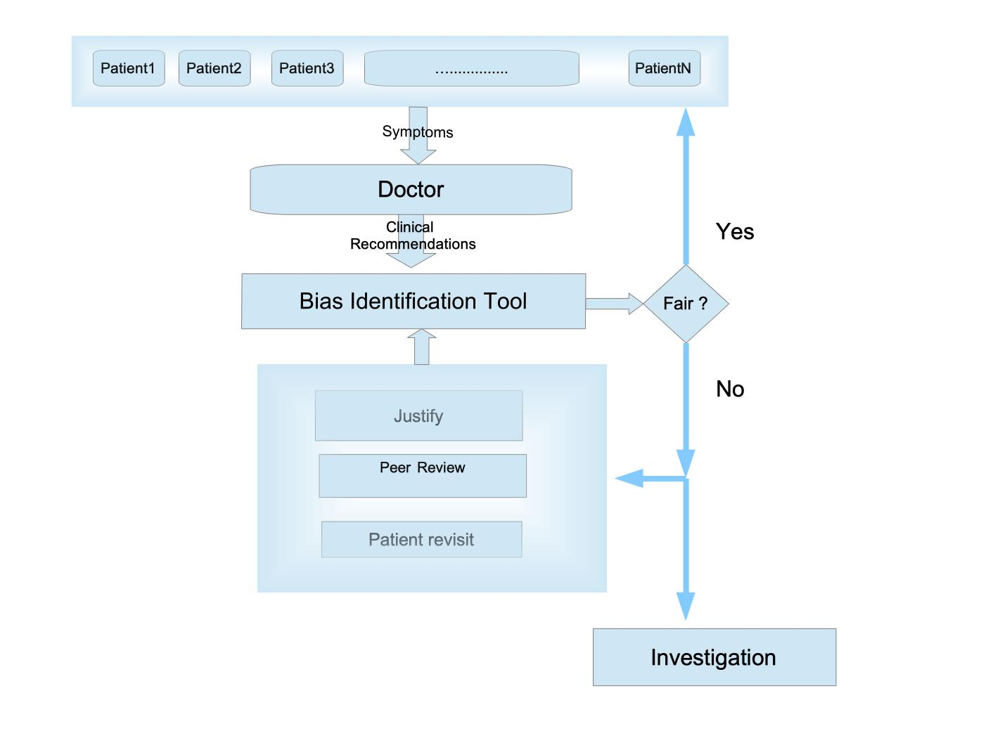
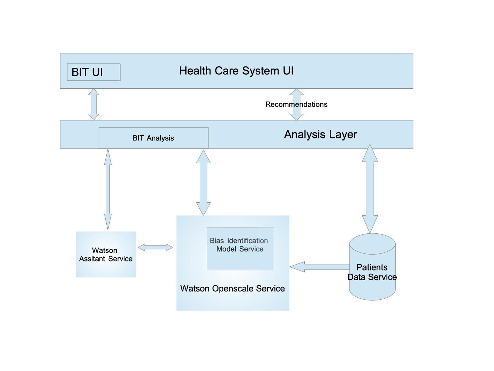

# Bias Identification Tool (B.I.T)
## Overview 
This project aims to build a bias identification tool for clinical recommendation from doctors and healthcare providers. This usecase focus on the general practisioners's recommendation and users of this tool includes central healthcare organisation like NHS, the patient union and other organisation that is responsible for delivering social welfare schemes. Using historical health data it is possible to identify consicious and unconsicious bias in a doctor recommendation. In UK on average a general practitioner is responsible for providing health care service to 2087 people who come from a patricular geographical location. The patients will be belonging to different ethincity, gender, drug addiction history, age, languages, economic status etc. The goal of the tool is to identify any bias in their recommendation which would influence the quality of treatment provided to the patient e.g. patient time,recommended diagnostic checkup, medication, medical advice etc.  The doctor is responsible for aduiting several dataset features associated with a particular alinment. This data would be available to others who have the required security clearence to handle it. To develop the tool we have to rely on publicly available data, but it is unavailable. Though archive data is available in the UK government website http://webarchive.nationalarchives.gov.uk, only data description is available. The data is not publically available at the moment, so require help to access real data. To proceed further we had to rely on mock data. An example of heart-disease dataset is used in this project to develop the tool.
## Work Flow

The workflow diagram provides details about how the tools will be used to identify the bias in a doctor recommendation for a patricular ailment. The tool would be used as an extended feature within an existing health care system which is already used by doctors to audit their recommendation to their patients. 
## Architecture 
 
